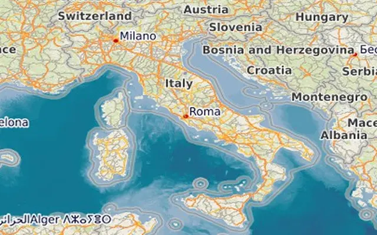

# Geop 

Render images of maps in php.

* Render maps with tile providers such as OpenStreetMap
* Render maps with WMS based services
* Project/unproject lat/lon points
* Supported map projections EPSG:3857, EPSG:3395 and EPSG:4326 
* Render geojson geometries


## Render a map image

Below is an example showing how to render a map image of size 640 x 480 pixels centered
at latitude 41.381073 and longitude 2.173224 and zoom level 5.

```php
<?php
require_once("geop.php");
use \geop\LatLon;
use \geop\Map;
use \geop\CRS_EPSG3857;
use \geop\TileService;
use \geop\FileTileCache;
use \geop\MapRenderer;
use \geop\ImagickFactory;

$latlon = new LatLon(41.381073, 2.173224);
$zoom = 5;

$tileservice = new TileService(["url" => "https://tile.openstreetmap.org/{z}/{x}/{y}.png"], 
                            new FileTileCache('osm'));

$map = new Map(new CRS_EPSG3857());
// OSM has tile size of 256 pixels
$map->setTileSize(256);
$imgfactory = new ImagickFactory();

$renderer = new MapRenderer($map, $tileservice, $imgfactory);
$output = $renderer->renderMap($latlon, $zoom, 640, 400);
$imgfactory->saveImageToFile($output['image'], "assets/map1.webp");
```


## Pseudo Mercator projection

Understanding the pseudo Mercator map projection EPSG:3857 is easiest with an image. This shows the [Tissot's indicatrix](https://en.wikipedia.org/wiki/Tissot%27s_indicatrix). Each one of the circles has a radius of 200km
and they are placed at latitudes {-70, -60, -40, -20, 0, 20, 40, 60, 70} and longitudes 
{-160, -120, -80, -40, 0, 40, 80, 120, 160}. At equator the scaling factor of the projection is one, but as we get further away from the equator the scaling factor increases. This means countries further away from the equator have an inflated size in this projection.


The file **[example/circles.geojson](example/circles.geojson)** can be viewed at [https://geojson.io](https://geojson.io) and switching between Globe/Mercator demonstrates the effect.


## WMS tiles

Web Map Services (WMS) can be used with the **[WMSTileService](src/tileservice.php)**. 

```php
use \geop\WMSTileService;
```

The url should point to the WMS service. Parameters can be set in the url as query parameters or in the options. Possible layer names can be fetched with the **GetCapabilities** request from the WMS url (request=GetCapabilities).

```php
// https://www.terrestris.de/en/openstreetmap-wms/
$tileservice = new WMSTileService([
	"url" => "https://ows.terrestris.de/osm/service?",
	"layers" => "OSM-WMS",
	], new FileTileCache('terrestris-osm'));
```

For the above WMS tile service we can use the projection EPSG:4326. Check the **GetCapabilities** for supported projections.

```php
$map = new Map(new CRS_EPSG4326());
```

Instead of setting a lat/lon position and a zoom level, these can be computed by fitting a bounding box into the rendered map image:

```php
// Compute the center and zoom which fits the boundingbox in the render size
list($latlon, $zoom) = $renderer->fitBounds(new LatLon(36.267, 6.577), new LatLon(47.374, 18.654), 640, 400);
$output = $renderer->renderMap($latlon, $zoom, 640, 400);
$imgfactory->saveImageToFile($output['image'], "assets/map2.webp");
```



## Geojson

The map renderer supports adding a geojson layer:

```php
// Bounding box around Hamburg, Germany
list($latlon, $zoom) = $renderer->fitBounds(new LatLon(53.39861676102, 9.77002), new LatLon(53.705006628648, 10.211535), 640, 400);

// Add a geojson layer with some geometries
// The outer contour of the polygon is the above bounding box 
$gjson = file_get_contents(__DIR__."/hamburg.geojson");
// Define style for the rendered geometries
$style = [
	'strokecolor' => '#3388ff',
	'fillcolor' => '#3388ff3f',
	'strokewidth' => 3,
	'strokelinecap' => 'round',
	'strokelinejoin' => 'round',
	//'strokemiterlimit' => 10,
	'pointradius' => 8,
];
$renderer->addGeoJsonLayer($gjson, ['swapxy' => false, 'style' => $style]);
```


## Rendering backend
See the interface **[ImageFactory](src/imagefactory.php)** for what to implement for a custom
rendering backend. **[ImagickFactory](src/imagefactory.php)** implements a rendering backend using the php Imagick extension.


## Demo apps
In the folder **[example/](example/)** there are a couple of simple demo apps that showcase rendering of maps in different ways.

## Requirements
Developed in php and tested in 5.6, 8.2 and 8.4. Php built with the Imagick extension is needed to use the
**ImagickFactory** rendering backend. 


## Tests
To run the tests you need [pest](https://github.com/deltadecay/pest) installed parallel to *geop*.
